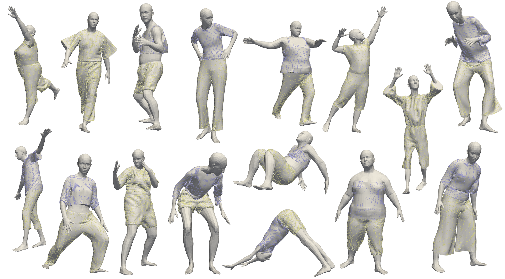

# GIM3D: A 3D dataset for garment segmentation
Musoni, P. and Melzi, S. and Castellani, U., GIM3D: A 3D dataset for garment segmentation, STAG 2022

<p align="center">


For the access to the dataset write to Pietro Musoni: pietro.musoni@univr.it

## Contents
* [Quick-start](https://github.com/PietroMsn/GIM3D#Quick-start)
* [Requirements](https://github.com/PietroMsn/GIM3D#requirements)
* [License](https://github.com/PietroMsn/GIM3D#license)
* [Acknowledgements](https://github.com/PietroMsn/GIM3D#acknowledgements)
  
## Quick-start  

  
  
## Requirements

  
  
## License
Please check the license terms (also of third parts software) before downloading and/or using the code, the models and the data. 
All code and results obtained from it not already covered by other licenses has to be intendend only for non-commercial scientific research purposes.
Any other use, in particular any use for commercial purposes, is prohibited. This includes, without limitation, incorporation in a commercial product, use in a commercial service, or production of other artefacts for commercial purposes including, for example, 3D models, movies, or video games. 

## Acknowledgements
  
This work is partially supported by the project of the Italian Ministry of Education, Universities and Research (MIUR) ”Dipartimenti di Eccellenza 2018-2022” of the Department of Computer Science of Verona University

If you use this code and/or data, please cite:
```
@inproceedings {10.2312:stag.20221252,
booktitle = {Smart Tools and Applications in Graphics - Eurographics Italian Chapter Conference},
editor = {Cabiddu, Daniela and Schneider, Teseo and Allegra, Dario and Catalano, Chiara Eva and Cherchi, Gianmarco and Scateni, Riccardo},
title = {{GIM3D: A 3D Dataset for Garment Segmentation}},
author = {Musoni, Pietro and Melzi, Simone and Castellani, Umberto},
year = {2022},
publisher = {The Eurographics Association},
ISSN = {2617-4855},
ISBN = {978-3-03868-191-5},
DOI = {10.2312/stag.20221252}
}
```
